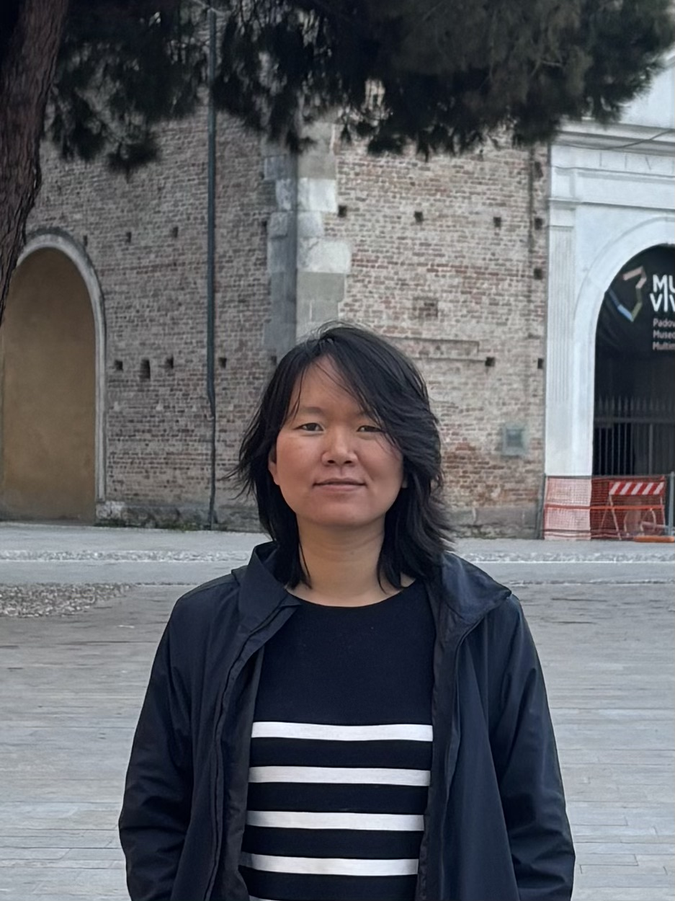

<head>
    <meta charset="UTF-8">
    <title>Grace X. Yang</title>
    
</head>

    
    

        <h1>Grace X. Yang</h1>
        
<strong>Ph.D. Candidate in International Relations</strong>

        
Freie Universität Berlin

        
<strong>Interdisciplinary Consultant</strong>

        
Digital Policy & Market Strategy

        
        

            <a href="mailto:Graceyang_pro@outlook.com">Email</a>
            <a href="https://www.linkedin.com/in/xiaojuan-yang/">LinkedIn</a>
            <a href="https://github.com/xiaojuan-yang">GitHub</a>
            <a href="https://scholar.google.com/">Google Scholar</a>
        

    

    <a href="index.html">About</a>
    <a href="research.html">Research</a>
    <a href="experience.html">Consultancy</a>
    <a href="wenshe.html">Wenshe</a>

<h3>About Me</h3>

I am an interdisciplinary researcher and consultant bridging the gap between global political thoery and practice. My work explores the intersection of digital technology, state sovereignty, and political strategies.

As a researcher, I employ computational social science methods to unpack political discourses. As a consultant, I translate theoretical insights into actionable intelligence for digital trade, market entry, and strategic communication.

<h3>Core Expertise</h3>
<ul>
    <li><strong>Academic:</strong> Global Governance, Sino-Russian Relations, Great Power Competition.</li>
    <li><strong>Technical:</strong> NLP Pipeline Development, Large-scale Textual Analysis, Python, SQL.</li>
    <li><strong>Consulting:</strong> Cross-border Market Strategy, Digital Trade Auditing, Multi-language Content Operations.</li>
</ul>

    &copy; 2026 Grace X. Yang. Expected PhD Completion: April 2026.

